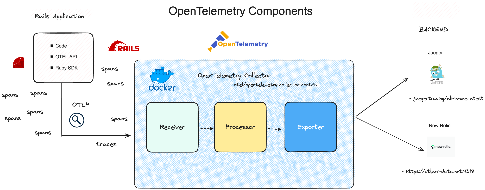

# OpenTelemetry CircuitVerse

CircuitVerse utilises OpenTelemetry using Jaeger and New Relic.

## Jaeger & New Relic Service

Refer to [OTEL-setup](https://github.com/CircuitVerse/CircuitVerse/tree/master/.otel) for detailed guide.

## Summary

The core objective of this service is to assist in comprehending system behavior and diagnosing latency issues. Jaeger stores traces that consist of spans, offering a detailed execution trace of a single request. This aids in comprehending the complete end-to-end flow.

## Architecture

The architecture of Jaeger is documented in [the Jaeger docs](https://www.jaegertracing.io/docs/latest/architecture/).

Here is a diagram of how it is deployed in our infrastructure:

The configuration we are running consists of:

- Collector: Running as docker container, this component receives spans from agents.
- Jaeger-all-in-one: Running as docker container, provides the user-facing UI for Jaeger.
 
## Links to further Documentation

- [OpenTelemetry](https://opentelemetry.io/)
- [Jaeger](https://www.jaegertracing.io/docs/latest/)
- [New Relic OTEL docs](https://docs.newrelic.com/docs/more-integrations/open-source-telemetry-integrations/opentelemetry/get-started/opentelemetry-set-up-your-app/)
