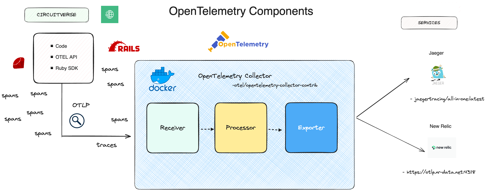

# OpenTelemetry CircuitVerse

CircuitVerse utilises OpenTelemetry using Jaeger and New Relic.

## Jaeger & New Relic Service

## Summary

The primary goal of this system is to aid in understanding system behaviour and diagnosis of latency.

Jaeger stores traces consisting of spans, which provide a fine-grained execution trace of the execution of a single request, through multiple layers of RPCs.
This allows engineers to understand the full end-to-end flow.

## Architecture

The architecture of Jaeger is documented in [the Jaeger
docs](https://www.jaegertracing.io/docs/latest/architecture/).

Here is a diagram of how it is deployed in our infrastructure:

The configuration we are running consists of:

- Collector: Running as docker container, this component receives spans from agents.
- Jaeger-all-in-one: Running in Kubernetes, this component queries Elasticsearch and
  provides the user-facing UI for Jaeger.
 
Elasticsearch: This is the storage backend for the Jaeger system. We run a
  dedicated Elasticsearch cluster for Jaeger in production.

The primary tuning parameter in distributed tracing systems is sampling rate.

## Deployment

## Setup/Configuration

Refer to [OTEL-setup](https://github.com/CircuitVerse/CircuitVerse/tree/master/.otel)

## Links to further Documentation

- [Jaeger](https://www.jaegertracing.io/docs/latest/)
- [OpenTelemetry](https://opentelemetry.io/)
